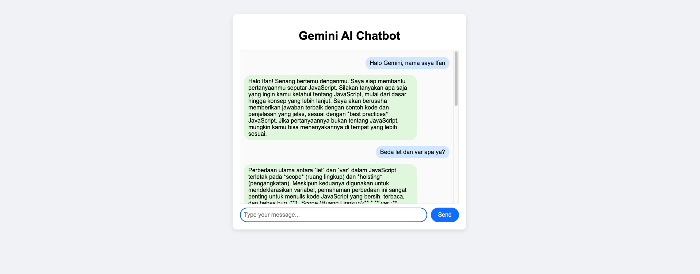

# Gemini AI Chatbot

A simple web-based chatbot powered by Google Gemini API. This project consists of a Node.js backend (API) and a frontend client.

## Features
- Chat with Gemini AI in real time
- Simple and clean UI
- Easy to set up and run locally

## Project Structure

```
gemini-chatbot-api/   # Node.js backend (Express API)
gemini-starter/       # Frontend (HTML, CSS, JS)
```

## Getting Started

### 1. Clone the Repository

```
git https://github.com/ifanzalukhu97/gemini-ai-api-project-hacktiv8-lesson4.git
```

### 2. Set Up the Backend

1. Go to the backend folder:
   ```
   cd gemini-chatbot-api
   ```
2. Install dependencies:
   ```
   npm install
   ```
3. Create a `.env` file in `gemini-chatbot-api/` with the following content:
   ```env
   GEMINI_API_KEY=your_google_gemini_api_key_here
   ```
   - Replace `your_google_gemini_api_key_here` with your actual Gemini API key.

4. Start the backend server:
   ```
   npm start
   ```
   The server will run at `http://localhost:3000` by default.

### 3. Set Up the Frontend

1. Open a new terminal and go to the frontend folder:
   ```
   cd ../gemini-starter
   ```
2. Open `index.html` in your browser (you can just double-click the file or use a local server like Live Server in VSCode).

### 4. Usage
- Type your message in the input box and press **Send**.
- The chatbot will respond using the Gemini API.

## Notes
- Make sure your backend server is running before using the frontend.
- The frontend expects the backend to be available at `http://localhost:3000`.
- You need a valid Google Gemini API key to use this project.

## Documentation



