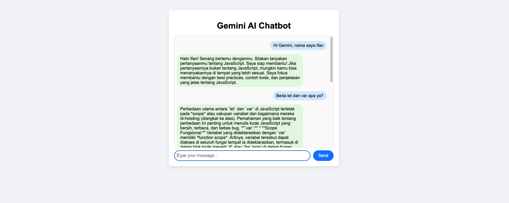

# Gemini AI Chatbot

A simple chatbot powered by Google Gemini API. This project consists of a Node.js backend (API) and a frontend client located in the `public` folder inside the backend project.

## Features
- Chat with Gemini AI in real time
- Simple and clean UI (accessed via the `public` folder)
- Easy to set up and run locally

## Getting Started

### 1. Clone the Repository

```
git clone https://github.com/ifanzalukhu97/gemini-ai-api-project-hacktiv8-lesson4.git
```

### 2. Set Up the Backend (and Frontend)

1. Go to the backend folder:
   ```
   cd gemini-chatbot-api
   ```
2. Install dependencies:
   ```
   npm install
   ```
3. Create a `.env` file in `gemini-chatbot-api/` with the following content:
   ```env
   GEMINI_API_KEY=your_google_gemini_api_key_here
   ```
   - Replace `your_google_gemini_api_key_here` with your actual Gemini API key.

4. Start the backend server:
   ```
   npm start
   ```
   The server will run at `http://localhost:3000` by default.

### 3. Usage
- Open your browser and go to `http://localhost:3000` to access the chatbot UI (served from the `public` folder).
- Type your message in the input box and press **Send**.
- The chatbot will respond using the Gemini API.

## Notes
- The frontend is located in the `public` folder inside the backend project and is served automatically by the backend server.
- You need a valid Google Gemini API key to use this project.

## Documentation

